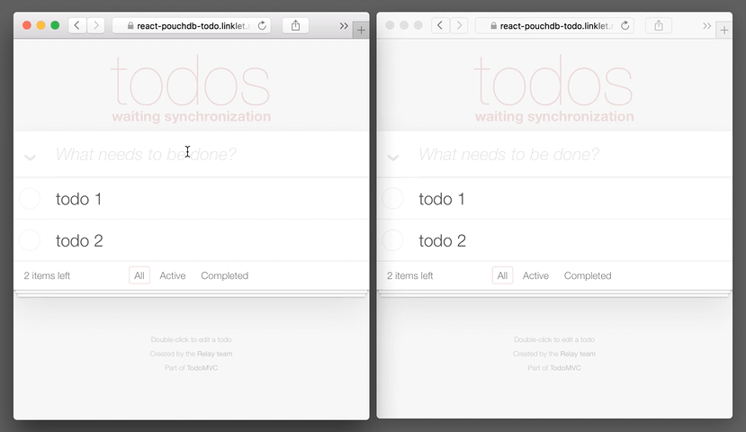

# react-pouchdb-todo example

__[Live Example](https://react-pouchdb-todo.linklet.run)__



## Setup

```bash
npm install
```

## Dev

```bash
npm run dev
```

__open [http://localhost:3000](http://localhost:3000)__

## Production build

```bash
npm run build
```

## DROPSTACK deployment

```bash
dropstack
```
